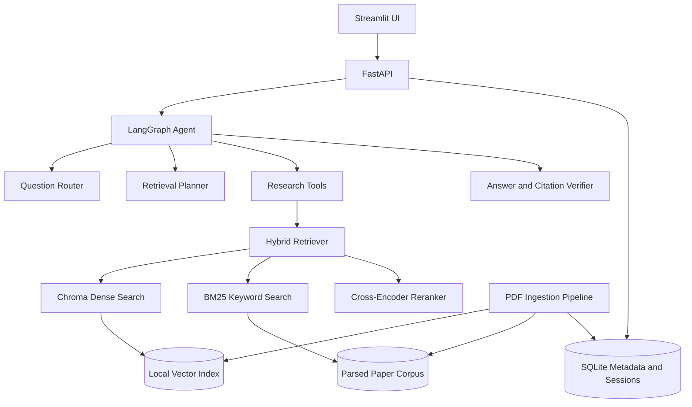
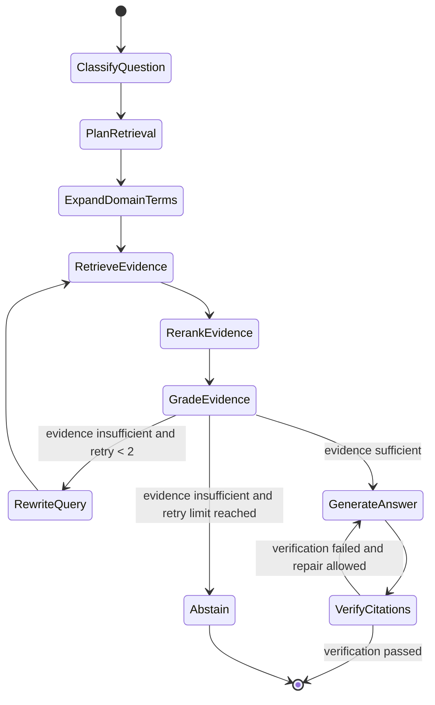
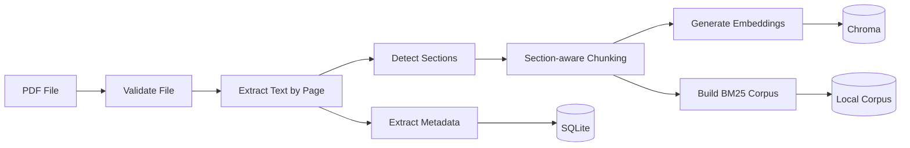

# HardSec Scholar 开发文档

> 面向硬件安全科研论文的可验证 Agentic RAG 助手

## 1. 文档信息

| 项目 | 内容 |
| --- | --- |
| 项目名称 | HardSec Scholar |
| 项目类型 | 个人项目 / 面试作品集 |
| 基础项目 | Open Deep Research |
| 主要领域 | 侧信道攻击、体系结构安全、硬件与体系结构模糊测试 |
| 主要语料 | 英文科研论文 PDF |
| 初期规模 | 约 10 篇论文 |
| 文档状态 | 第一版开发基线 |

## 2. 项目背景

通用 PDF 问答系统通常采用“切分文档、向量检索、生成回答”的固定流程。这种方式对简单事实问题有效，但在硬件安全论文场景中存在明显不足：

- 用户问题可能包含缩写、领域术语和论文中未直接出现的表达。
- 威胁模型、实验平台、攻击效果和防御开销可能分散在不同章节。
- 比较类问题通常需要跨多篇论文收集结构化证据。
- 第一次检索可能无法找到充分证据，需要主动改写查询并再次检索。
- 回答中的结论必须能够追溯到具体论文、章节、页码和原文。

HardSec Scholar 在 Open Deep Research 的 Agent 工作流基础上增加本地论文摄取、混合检索、领域术语扩展、证据评价、查询修正和引用验证能力，形成一个面向硬件安全科研论文的轻量 Agentic RAG 系统。

## 3. 项目目标

### 3.1 核心目标

1. 支持上传和索引英文科研论文 PDF。
2. 支持针对单篇或多篇论文进行自然语言问答。
3. 根据问题类型自主规划检索策略。
4. 使用 Dense Vector 与 BM25 进行混合检索。
5. 对候选证据进行重排和相关性评价。
6. 证据不足时自动改写查询，最多执行两轮补充检索。
7. 生成带论文标题、章节、页码和证据片段的回答。
8. 无充分证据时明确拒答，避免根据模型记忆猜测。
9. 建立离线评估集，对比基础 RAG 与 Agentic RAG。
10. 提供可演示的 Web 界面、Agent 执行轨迹和评估结果。

### 3.2 面试展示目标

项目需要清晰展示以下工程能力：

- LangGraph 状态机与条件路由。
- PDF 解析、章节感知切分和元数据管理。
- 混合检索、RRF 融合与 Cross-Encoder 重排。
- Agent 查询规划、自我修正和停止条件。
- 可验证引用与无答案拒答。
- 离线评估、基线实验和回归测试。
- 模块化架构、配置管理、日志与测试。

## 4. 非目标

第一版不实现以下能力：

- 本地大语言模型。
- GraphRAG 或知识图谱。
- 多用户、租户、注册和登录。
- 多 Agent 并行研究。
- 扫描版 PDF OCR。
- 复杂公式推导与公式语义检索。
- 自动构建论文引用关系网络。
- 大规模分布式索引与部署。
- 自动下载受版权保护的论文。

这些能力可以在核心检索、引用和评估稳定后再作为扩展项评估。

## 5. 典型使用场景

### 5.1 单篇论文事实问答

```text
What processor and experimental setup were used in this paper?
```

系统应定位 Experimental Setup 或 Evaluation 章节，并返回带页码的答案。

### 5.2 威胁模型分析

```text
Does the attack require physical access to the target device?
```

系统应优先检索 Threat Model、Assumptions 和 Attack Model，不得仅根据摘要推断。

### 5.3 跨论文比较

```text
Compare the feedback mechanisms used by these hardware fuzzing papers.
```

系统应拆分为多个论文级子任务，分别抽取反馈类型、覆盖率指标、实验平台和局限性，最后生成带逐项引用的对比表格。

### 5.4 查询自我修正

```text
Which SCA methods reduce the number of required traces?
```

如果原查询没有找到足够证据，Agent 应扩展 SCA、trace complexity、sample efficiency 等领域表达并重新检索。

### 5.5 无答案拒答

当论文库没有支持某结论的证据时，系统应返回：

```text
The indexed papers do not provide enough evidence to answer this question.
```

同时说明已检索的范围和缺少的证据类型。

## 6. 总体架构



### 6.1 技术选型

| 组件 | 技术 | 选择原因 |
| --- | --- | --- |
| Agent 编排 | LangGraph / Open Deep Research | 支持显式状态、条件边、重试与工具调用 |
| API | FastAPI | 类型清晰、易于流式输出和自动生成接口文档 |
| UI | Streamlit | 适合个人项目快速开发和面试演示 |
| PDF 解析 | PyMuPDF | 轻量、稳定，可保留页码信息 |
| 向量存储 | ChromaDB 本地持久化 | 10 篇论文规模无需独立数据库服务 |
| 关键词检索 | BM25 | 提升缩写、专有名词和精确术语召回 |
| 结果融合 | Reciprocal Rank Fusion | 简单稳定，无需对不同检索分数人工归一化 |
| 重排 | 轻量 Cross-Encoder | 提高最终证据相关性，适合英文论文 |
| 元数据 | SQLite | 轻量、可查询，便于保存论文和会话状态 |
| 模型访问 | OpenAI 兼容 API | 不绑定单一供应商，不支持本地 LLM |
| 包管理 | uv | 安装和锁定依赖速度快 |
| 测试 | pytest | Python 生态成熟，适合单元和集成测试 |
| 静态检查 | Ruff、mypy | 复用上游工具链，统一格式、Lint 与类型检查 |

## 7. Agent 设计

### 7.1 状态机



### 7.2 Agent 状态

```python
class ResearchState(TypedDict):
    conversation_id: str
    question: str
    question_type: str
    selected_paper_ids: list[str]
    sub_questions: list[str]
    search_queries: list[str]
    retrieved_chunks: list[dict]
    selected_evidence: list[dict]
    answer: str | None
    citations: list[dict]
    retry_count: int
    max_retries: int
    verification_result: dict | None
    trace_events: list[dict]
```

### 7.3 节点职责

#### `classify_question`

将问题分类为：

- `fact`
- `mechanism`
- `threat_model`
- `experiment`
- `metric`
- `comparison`
- `limitation`

分类结果决定优先章节、是否拆分问题以及回答格式。

#### `plan_retrieval`

- 判断需要查询单篇还是多篇论文。
- 生成一个或多个子问题。
- 指定优先检索的章节类型。
- 判断是否需要结构化比较输出。

#### `expand_domain_terms`

- 展开领域缩写。
- 生成论文中可能使用的近义表达。
- 为不同子问题生成独立检索查询。
- 不修改用户原始问题。

#### `retrieve_evidence`

- 同时执行向量检索与 BM25。
- 使用 RRF 合并结果。
- 根据用户选定论文和章节过滤候选片段。
- 保留原始检索排名和分数，用于调试及评估。

#### `rerank_evidence`

- 对融合后的 Top-N 候选结果进行 Cross-Encoder 重排。
- 返回最终 Top-K 证据。
- 去除高度重复或相邻重叠片段。

#### `grade_evidence`

评价证据是否：

- 与问题相关。
- 覆盖问题的关键条件。
- 足以支撑回答。
- 对比较问题覆盖了全部目标论文或比较维度。

输出必须是结构化结果，不能只返回自然语言判断。

#### `rewrite_query`

- 根据证据缺口改写查询。
- 禁止简单重复上一轮查询。
- 记录改写原因。
- 最多执行两轮补充检索。

#### `generate_answer`

- 仅使用选定证据生成回答。
- 每个关键结论必须绑定证据 ID。
- 不得使用无证据支持的模型背景知识补全结论。
- 比较类问题优先使用 Markdown 表格。

#### `verify_citations`

- 检查引用的证据是否实际支持相邻结论。
- 检查论文、章节和页码是否存在。
- 检查是否存在无引用的核心结论。
- 允许一次回答修正，但不触发无限生成循环。

#### `abstain`

- 明确说明当前论文库证据不足。
- 描述缺少的证据类型。
- 不生成猜测性回答。

## 8. 领域模型

### 8.1 研究方向

```python
class ResearchArea(str, Enum):
    SIDE_CHANNEL_ATTACK = "side_channel_attack"
    ARCHITECTURAL_SECURITY = "architectural_security"
    HARDWARE_FUZZING = "hardware_fuzzing"
    OTHER = "other"
```

### 8.2 领域字段

论文问答过程中允许按以下 Schema 抽取信息：

```python
class HardSecEvidence(BaseModel):
    research_area: ResearchArea | None
    attack_or_defense: str | None
    target: list[str]
    threat_model: str | None
    attacker_capabilities: list[str]
    prerequisites: list[str]
    platform: list[str]
    evaluation_type: str | None
    metrics: dict[str, str]
    overhead: dict[str, str]
    limitations: list[str]
    evidence_ids: list[str]
```

该结构用于回答和比较，不作为无引用的自动事实库。任何字段必须能够回溯到原始证据。

### 8.3 术语扩展词典

初始词典至少包含：

```yaml
sca:
  - side-channel attack
  - side channel analysis
dpa:
  - differential power analysis
cpa:
  - correlation power analysis
em:
  - electromagnetic
  - electromagnetic side channel
fi:
  - fault injection
puf:
  - physical unclonable function
rtl:
  - register-transfer level
dut:
  - device under test
fuzzing:
  - fuzz testing
  - coverage-guided fuzzing
  - hardware fuzzing
microarchitectural:
  - micro-architectural
  - architecture-level
```

词典通过 YAML 管理，允许后续根据论文语料扩充，无需修改 Agent 代码。

## 9. 论文摄取流程



### 9.1 文件校验

- 仅接受 PDF。
- 设置单文件大小上限。
- 使用内容哈希识别重复论文。
- 检查是否能够提取文本。
- 对扫描版 PDF 返回明确的不支持提示。

### 9.2 元数据提取

优先从 PDF 文本第一页和文档属性提取：

- 标题
- 作者
- 年份
- 摘要
- DOI（若存在）
- 页数

无法可靠提取的字段允许用户在 UI 中手工修正。

### 9.3 章节识别

优先识别：

- Abstract
- Introduction
- Background
- Related Work
- Threat Model
- Attack Model
- Method / Methodology
- Implementation
- Experimental Setup
- Evaluation
- Results
- Discussion
- Limitations
- Conclusion
- References

章节识别失败时回退到页码感知的普通切分。

### 9.4 切分规则

- 优先按章节和自然段切分。
- Chunk 不跨越明显章节边界。
- 每个 Chunk 保存起止页码。
- 保留适量上下文重叠。
- References 默认降低检索权重或排除。
- 图注和表格标题应与相邻描述尽量保存在同一片段。

初始参数建议：

```yaml
chunk_size_tokens: 700
chunk_overlap_tokens: 100
retrieval_top_k: 20
rerank_top_k: 6
max_retrieval_retries: 2
```

这些参数必须配置化，并通过评估集调整，不能硬编码在业务逻辑中。

## 10. 数据结构

### 10.1 Paper

```json
{
  "id": "paper_001",
  "content_hash": "sha256:...",
  "title": "Paper title",
  "authors": ["Author A", "Author B"],
  "year": 2025,
  "doi": null,
  "research_area": "hardware_fuzzing",
  "file_path": "data/papers/paper_001.pdf",
  "page_count": 12,
  "status": "indexed",
  "created_at": "2026-08-19T00:00:00Z"
}
```

### 10.2 PaperChunk

```json
{
  "id": "paper_001_chunk_026",
  "paper_id": "paper_001",
  "title": "Paper title",
  "section": "Evaluation",
  "page_start": 7,
  "page_end": 8,
  "chunk_index": 26,
  "source_type": "paragraph",
  "text": "..."
}
```

### 10.3 Evidence

```json
{
  "id": "evidence_001",
  "chunk_id": "paper_001_chunk_026",
  "paper_id": "paper_001",
  "section": "Evaluation",
  "page_start": 7,
  "page_end": 8,
  "text": "...",
  "dense_rank": 3,
  "bm25_rank": 1,
  "fusion_score": 0.032,
  "rerank_score": 0.88
}
```

### 10.4 Citation

```json
{
  "evidence_id": "evidence_001",
  "paper_id": "paper_001",
  "paper_title": "Paper title",
  "section": "Evaluation",
  "page_start": 7,
  "page_end": 8,
  "claim": "The fuzzer uses RTL coverage as feedback."
}
```

## 11. 检索设计

### 11.1 Dense Retrieval

- 使用在线 Embedding API 生成英文论文片段向量。
- ChromaDB 本地持久化向量及元数据。
- 支持按 `paper_id`、`research_area` 和 `section` 过滤。

### 11.2 BM25 Retrieval

- 使用英文分词和标准化后的论文片段建立 BM25 索引。
- 保留缩写、芯片型号、指令名和指标名。
- 不进行可能破坏专业术语的激进词干化。

### 11.3 RRF 融合

初始实现：

```text
RRF(d) = Σ 1 / (k + rank_i(d))
```

初始 `k` 建议为 60，通过评估结果调整。

### 11.4 Reranker

- 对融合后的 Top-20 结果重排。
- 最终保留 Top-6。
- 比较问题允许为每个子问题分别保留 Top-K，避免单篇论文占满上下文。

### 11.5 去重与上下文组装

- 合并同一论文中相邻且高度重叠的片段。
- 保留来源边界，不把不同论文拼成一个证据对象。
- 按问题需求控制每篇论文的最大证据数量。
- 上下文中使用稳定证据 ID，生成阶段只能引用这些 ID。

## 12. 工具定义

Agent 第一版只开放四个工具：

### `list_papers`

返回当前论文库的论文 ID、标题、年份、研究方向和索引状态。

### `search_papers`

输入：

```json
{
  "query": "coverage feedback in hardware fuzzing",
  "paper_ids": ["paper_001", "paper_002"],
  "preferred_sections": ["Methodology", "Evaluation"],
  "top_k": 6
}
```

输出为结构化 Evidence 列表。

### `read_evidence`

根据证据 ID 返回完整文本和来源元数据，用于确认或扩展上下文。

### `web_search`

- 默认关闭。
- 仅当用户明确要求外部资料或最新信息时启用。
- 外部网页证据必须与本地论文证据使用不同引用类型。

## 13. API 设计

### 13.1 论文接口

```text
POST   /api/papers
GET    /api/papers
GET    /api/papers/{paper_id}
PATCH  /api/papers/{paper_id}
DELETE /api/papers/{paper_id}
POST   /api/papers/{paper_id}/reindex
```

### 13.2 对话接口

```text
POST /api/conversations
GET  /api/conversations/{conversation_id}
POST /api/conversations/{conversation_id}/messages
GET  /api/runs/{run_id}/events
```

消息请求示例：

```json
{
  "question": "Compare the feedback mechanisms in the selected fuzzing papers.",
  "paper_ids": ["paper_001", "paper_002"],
  "allow_web_search": false
}
```

### 13.3 流式事件

API 使用 SSE 输出以下事件：

```text
question_classified
retrieval_planned
query_expanded
retrieval_started
evidence_retrieved
evidence_graded
query_rewritten
answer_generating
citation_verifying
completed
failed
```

每个事件包含 `run_id`、时间、节点名称和可安全展示的摘要，不输出模型隐藏推理。

### 13.4 评估接口

```text
POST /api/evaluations
GET  /api/evaluations
GET  /api/evaluations/{evaluation_id}
```

## 14. UI 设计

### 14.1 论文库页面

- 上传 PDF。
- 显示解析与索引进度。
- 展示标题、作者、年份、方向和页数。
- 修改识别错误的元数据。
- 删除或重新索引论文。

### 14.2 智能问答页面

- 选择全部或部分论文。
- 输入问题。
- 显示流式回答。
- 显示 Agent 当前阶段。
- 展开查看检索查询、查询改写原因和选定证据。
- 点击引用查看论文标题、页码、章节和原文片段。

### 14.3 评估页面

- 选择 Baseline RAG 或 Agentic RAG。
- 启动评估。
- 展示检索、回答、引用、延迟和费用指标。
- 对比两种方案的结果。

## 15. 模型与配置

### 15.1 环境变量

```env
LLM_PROVIDER=openai
LLM_MODEL=
LLM_API_KEY=
LLM_BASE_URL=

EMBEDDING_PROVIDER=openai
EMBEDDING_MODEL=
EMBEDDING_API_KEY=
EMBEDDING_BASE_URL=

ALLOW_WEB_SEARCH=false
WEB_SEARCH_PROVIDER=
WEB_SEARCH_API_KEY=

DATABASE_URL=sqlite:///data/hardsec_scholar.db
CHROMA_PATH=data/chroma
PAPERS_PATH=data/papers
```

### 15.2 应用配置

```yaml
retrieval:
  dense_top_k: 20
  bm25_top_k: 20
  rerank_top_k: 6
  rrf_k: 60

agent:
  max_retrieval_retries: 2
  max_answer_repairs: 1
  web_search_default: false

chunking:
  chunk_size_tokens: 700
  overlap_tokens: 100

ingestion:
  max_file_size_mb: 50
  exclude_references: true
```

## 16. 数据与隐私

- 原始 PDF、Chroma 索引、BM25 语料和 SQLite 数据保存在本机。
- 使用在线 Embedding 时，论文片段会发送给 Embedding 服务商。
- 生成回答时，只有最终选定的少量证据片段发送给生成模型。
- 默认不把完整论文发送给生成模型。
- API Key 只能存放在环境变量或本地 `.env` 中。
- `.env`、PDF、索引、数据库和运行日志不得提交到 Git。
- 日志不得记录 API Key、完整论文正文或完整模型请求。
- 公开部署前需要增加认证、上传限制、内容清理和安全评估。

## 17. 错误处理

系统至少需要处理：

- PDF 无法解析。
- PDF 是扫描件且没有文本层。
- 元数据提取失败。
- 重复上传。
- Embedding API 超时或限流。
- LLM 返回无法解析的结构化输出。
- Chroma 或 SQLite 写入失败。
- Agent 达到最大重试次数。
- 引用验证失败。
- SSE 连接中断。

对可重试的外部 API 错误采用有限次数的指数退避；对 Agent 逻辑重试使用独立计数器，不能与网络重试混用。

## 18. 日志与可观测性

每次执行生成唯一 `run_id`，记录：

- 问题类型。
- 生成的检索查询。
- 每轮检索耗时。
- Dense、BM25、融合与重排结果 ID。
- 证据评分结果。
- 查询改写原因。
- 模型调用耗时、Token 和估算费用。
- 最终使用的证据 ID。
- 引用验证结果。
- 最终状态和错误类型。

第一版使用结构化 JSON 日志。LangSmith、Phoenix 或 Langfuse 可作为后续可选集成，不作为核心运行依赖。

## 19. 测试策略

### 19.1 单元测试

- 领域术语扩展。
- 章节名称标准化。
- Chunk 页码和边界。
- BM25 索引与查询。
- RRF 融合排序。
- 相邻片段去重。
- Citation 数据校验。
- Agent 路由条件和重试上限。
- 无答案拒答逻辑。

### 19.2 集成测试

- 上传 PDF 到完成索引。
- 使用固定语料执行混合检索。
- 从用户问题到生成带引用回答。
- 证据不足时触发查询改写。
- 达到最大重试后进入拒答节点。
- 删除论文后同步清理索引。

### 19.3 测试隔离

- 单元测试不得依赖真实 LLM API。
- 使用固定结构化响应模拟模型决策。
- 使用小型测试 PDF 和临时数据库。
- 真实模型的端到端测试单独标记，默认不在普通 CI 中执行。

## 20. 离线评估

### 20.1 数据集

基于 10 篇论文人工建立 30 至 50 个问题：

| 类型 | 建议数量 |
| --- | ---: |
| 单论文事实 | 10 |
| 方法或攻击原理 | 5 |
| 威胁模型 | 5 |
| 实验设置与指标 | 5 |
| 跨论文比较 | 5 |
| 无答案问题 | 5 |

每个样本至少包含：

```json
{
  "question": "...",
  "question_type": "threat_model",
  "paper_ids": ["paper_001"],
  "reference_answer": "...",
  "relevant_chunk_ids": ["paper_001_chunk_010"],
  "expected_pages": [4],
  "should_abstain": false
}
```

### 20.2 指标

#### 检索指标

- Recall@5
- Recall@10
- MRR
- 正确论文命中率
- 正确页码命中率

#### 回答指标

- Answer Relevance
- Faithfulness
- 关键点覆盖率
- 拒答准确率

#### 引用指标

- Citation Precision
- Citation Coverage
- 页码准确率
- 引用支持率

#### Agent 指标

- 查询改写触发率
- 二次检索改善率
- 无效循环率
- 平均检索轮数

#### 工程指标

- P50/P95 延迟
- Token 使用量
- 单问题估算费用
- 索引耗时

### 20.3 对照实验

必须保留两个可运行配置：

```text
Baseline RAG:
Question → Dense Retrieval → Generate

Agentic RAG:
Classify → Plan → Hybrid Retrieve → Rerank → Grade
→ Rewrite if needed → Generate → Verify
```

README 和面试材料应使用相同评估集展示两种方案的量化差异。

## 21. 项目目录

计划目录如下。实际接入 Open Deep Research 后，可根据上游当前结构进行小幅调整。

```text
hardsec-scholar/
├── src/
│   ├── open_deep_research/       # 上游核心或兼容层
│   └── hardsec_scholar/
│       ├── agent/
│       │   ├── graph.py
│       │   ├── state.py
│       │   ├── nodes.py
│       │   └── prompts.py
│       ├── ingestion/
│       │   ├── parser.py
│       │   ├── chunker.py
│       │   ├── metadata.py
│       │   └── indexer.py
│       ├── retrieval/
│       │   ├── vector.py
│       │   ├── keyword.py
│       │   ├── hybrid.py
│       │   └── reranker.py
│       ├── tools/
│       │   ├── list_papers.py
│       │   ├── search_papers.py
│       │   ├── read_evidence.py
│       │   └── web_search.py
│       ├── domain/
│       │   ├── taxonomy.py
│       │   ├── terminology.yaml
│       │   └── schemas.py
│       ├── evaluation/
│       │   ├── dataset.py
│       │   ├── retrieval_metrics.py
│       │   ├── citation_metrics.py
│       │   └── runner.py
│       └── api/
│           ├── app.py
│           ├── papers.py
│           ├── conversations.py
│           └── evaluations.py
├── app/
│   └── streamlit_app.py
├── config/
│   ├── default.yaml
│   └── terminology.yaml
├── data/
│   ├── papers/
│   ├── chroma/
│   └── evaluations/
├── tests/
│   ├── fixtures/
│   ├── unit/
│   └── integration/
├── scripts/
│   ├── ingest_papers.py
│   └── run_evaluation.py
├── .env.example
├── .gitignore
├── pyproject.toml
├── uv.lock
├── README.md
└── DEVELOPMENT.md
```

## 22. 开发里程碑

### M0：底座核验

任务：

- 获取并运行 Open Deep Research。
- 核对上游依赖、配置、状态图和许可证。
- 确定采用 Fork、上游代码内扩展或兼容层的具体方式。
- 建立项目目录、配置、测试和代码质量工具。

验收：

- 原始研究流程能够运行。
- 项目可通过一条命令安装依赖。
- Ruff、mypy 和 pytest 可执行。

### M1：论文摄取与基础检索

任务：

- PDF 上传、校验和哈希去重。
- 元数据提取。
- 页码与章节感知切分。
- Chroma 与 BM25 索引。
- 论文增删改查。

验收：

- 10 篇论文可完成索引。
- 给定原文查询能返回正确论文、章节和页码。
- 删除论文后不会留下可检索的孤立片段。

### M2：基础 RAG

任务：

- Dense 与 BM25 混合检索。
- RRF 与 Reranker。
- 带引用回答。
- 引用原文展示。
- 无证据拒答。

验收：

- 单论文事实问题可返回正确引用。
- 回答中的关键结论具有证据 ID。
- 文档不存在答案时不会编造。

### M3：Agentic RAG

任务：

- 问题分类与检索规划。
- 硬件安全术语扩展。
- 证据评价。
- 查询改写与有限重试。
- 跨论文比较。
- 回答和引用验证。

验收：

- 能演示一次成功的查询自我修正。
- 比较问题能覆盖目标论文和比较维度。
- Agent 不会超过配置的重试上限。

### M4：UI、评估与交付

任务：

- Streamlit 页面。
- SSE 流式事件与执行轨迹。
- 建立评估数据集。
- Baseline 与 Agentic 对照实验。
- README、架构图、截图和演示脚本。

验收：

- 用户可以通过 UI 完成上传、索引、问答和引用查看。
- 评估可重复执行并保存结果。
- README 包含明确的运行方式、架构说明和量化结果。

## 23. 完成标准

第一版只有同时满足以下条件才视为完成：

1. 可以索引约 10 篇英文硬件安全论文。
2. 可以按论文、章节和页码检索证据。
3. Dense、BM25、RRF 和 Reranker 均可独立测试。
4. Agent 可以规划检索并在证据不足时改写查询。
5. Agent 的检索循环具有明确停止条件。
6. 回答中的关键结论具有可展开的引用。
7. 系统能够对无答案问题拒答。
8. 至少存在 30 个带人工标注的评估问题。
9. 可以对比 Baseline RAG 与 Agentic RAG。
10. 项目能够通过自动化测试、Lint 和类型检查。
11. README 足以让第三方完成安装和演示。
12. 不提交论文、密钥、数据库和本地索引。

## 24. 风险与应对

| 风险 | 影响 | 应对方式 |
| --- | --- | --- |
| PDF 章节识别不稳定 | Chunk 语义和引用质量下降 | 规则识别加回退策略，允许人工修正元数据 |
| 表格抽取丢失 | 无法回答开销和指标问题 | 第一版保留表格 Caption，后续接入 Docling |
| LLM 结构化输出失败 | Agent 路由中断 | Pydantic 校验、解析回退和有限重试 |
| 查询改写造成漂移 | 检索到无关论文 | 改写必须保留原始问题约束，记录证据缺口 |
| 比较问题上下文过长 | 成本和延迟上升 | 按子问题与论文分组检索，先抽取再汇总 |
| 引用看似相关但不支持结论 | 回答可信度下降 | 独立引用验证节点和人工评估指标 |
| 在线 API 不稳定 | 执行失败 | 超时、有限网络重试和可配置供应商接口 |
| 上游 Open Deep Research 更新 | 产生合并冲突 | 新功能集中到独立包，通过兼容层接入上游 |

## 25. 后续扩展方向

核心版本完成后，可按价值选择：

1. Docling/MinerU 表格与复杂布局解析。
2. 从表格中结构化提取性能、面积、功耗、Trace 数量等指标。
3. 接入 Semantic Scholar 或 Crossref 补充论文元数据。
4. 增加论文关系图和引用网络。
5. 增加 Web Search，用于发现论文库之外的最新研究。
6. 增加本地 Embedding，减少全文发送给外部服务。
7. 使用 Phoenix 或 Langfuse 进行完整链路观测。
8. 将 Streamlit 替换为独立前端。
9. 扩展至数百篇论文时迁移到 Qdrant Server。

## 26. 面试演示脚本

建议使用三个固定场景：

### 场景一：可验证事实问答

- 上传一篇侧信道攻击论文。
- 询问攻击目标、平台和所需 Trace 数量。
- 展示答案、页码和原文证据。

### 场景二：跨论文比较

- 选择多篇硬件模糊测试论文。
- 比较反馈机制、覆盖率指标、实验平台和局限性。
- 展示逐项引用的对比表格。

### 场景三：Agent 自我修正

- 使用缩写或论文未直接使用的表达提问。
- 展示初次检索证据不足。
- 展示术语扩展和查询改写。
- 展示第二轮检索如何找到正确证据。

演示结束后展示 Baseline 与 Agentic RAG 的评估对比，以说明新增工作流产生了可量化价值，而不是只增加模型调用次数。
