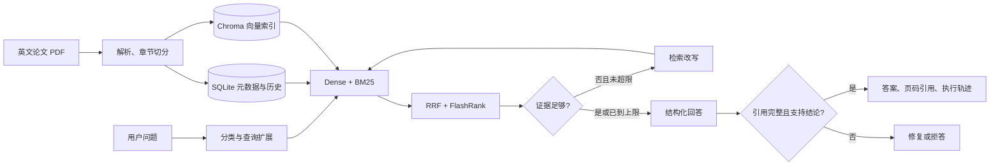

# HardSec Scholar

面向硬件安全论文的本地 Agentic RAG 助手。它把英文 PDF 解析、混合检索、有界检索改写、带页码引用的回答和 Agent 执行轨迹整合到一个可直接演示的网页应用中。

项目聚焦侧信道攻击、体系结构安全和模糊测试等方向，适合作为个人研究工具，也适合作为面试项目展示 RAG 工程、Agent 工作流、评估设计和安全边界。

> 当前语料与运行数据默认只保存在本机；Web 搜索默认关闭。扫描版 PDF 暂不支持 OCR。

## 核心能力

- 上传英文文本型 PDF，自动抽取标题、章节、页码并按章节切片。
- 使用 Dense + BM25、RRF 融合和 FlashRank 重排完成混合检索。
- 通过 LangGraph 执行问题分类、查询扩展、证据评价、有界改写、回答生成和引用验证。
- 每个关键结论绑定 Evidence ID，可回看论文、章节、页码和原文片段。
- 证据不足或引用验证失败时拒答，避免把无来源内容包装成论文结论。
- 网页实时展示安全摘要级 Agent 轨迹，不暴露模型隐藏推理或完整论文正文。
- 可按次关闭对话保存；已保存历史支持列表、完整消息查看、继续会话和级联删除。
- 提供 30 题真实论文评测集和 Dense Baseline / Agentic RAG 对照实验。

## 系统结构



后端使用 FastAPI，前端使用 React/Vinext；本地 SQLite 保存论文元数据、对话和运行轨迹，Chroma 保存向量。项目最初参考 [Open Deep Research](https://github.com/langchain-ai/open_deep_research) 立项，但论文摄取、混合检索、专用 LangGraph、引用验证、API、历史与评测均在 `hardsec_scholar` 包中独立实现；仓库不再携带未使用的上游运行代码。

## 快速开始（Windows）

环境要求：Python 3.10+、Node.js 22+、npm。

```powershell
git clone <your-repository-url>
cd <repository-directory>

python -m venv .venv
.\.venv\Scripts\python.exe -m pip install -U pip
.\.venv\Scripts\python.exe -m pip install -e ".[dev]"

Copy-Item .env.example .env
cd web
npm ci
cd ..
```

在 `.env` 中填写模型服务。当前已验证的 DeepSeek + SiliconFlow 组合为：

```env
LLM_PROVIDER=openai
LLM_MODEL=deepseek-v4-flash
LLM_API_KEY=your-deepseek-key
LLM_BASE_URL=https://api.deepseek.com

EMBEDDING_PROVIDER=openai
EMBEDDING_MODEL=BAAI/bge-m3
EMBEDDING_API_KEY=your-siliconflow-key
EMBEDDING_BASE_URL=https://api.siliconflow.cn/v1

ALLOW_WEB_SEARCH=false
NEXT_PUBLIC_API_URL=http://localhost:8000
```

这里的 `openai` 表示“OpenAI 兼容接口协议”，并不要求使用 OpenAI 的模型。LLM 和 Embedding 是两个独立服务，因此使用上述组合时需要分别填写 DeepSeek 与 SiliconFlow 的密钥。不要提交 `.env`；它已被 Git 忽略。

安装完成后，一条命令启动前后端：

```powershell
.\scripts\start_local.ps1
```

打开 `http://localhost:3000`。API 文档位于 `http://127.0.0.1:8000/docs`。停止服务：

```powershell
.\scripts\stop_local.ps1
```

若 PowerShell 阻止本地脚本，可仅对本次进程执行：

```powershell
Set-ExecutionPolicy -Scope Process Bypass
```

更完整的安装、手动启动和故障排查见 [本地运行指南](docs/LOCAL_APP.md)。

## 使用方式

1. 进入 **Paper library** 上传论文；当前已有本地索引时可直接查看。
2. 确认论文状态为 `indexed`。若只显示 `parsed`，检查 Embedding 配置后执行 Reindex。
3. 在 **Research** 中选择论文并提问；不选择时检索全部已索引论文。
4. 查看答案中的 Evidence ID、论文页码和原文证据。
5. 展开 Agent trace，观察查询扩展、检索重试、生成与引用验证过程。
6. 按需关闭 **Save conversation history**；在 **History** 中查看、继续或删除已保存会话。

## 真实评测结果

评测语料包含 10 篇硬件安全论文、157 页、324 个切片；内部评测集包含 30 题，其中 27 题可回答、3 题应拒答。两个系统均检索完整语料，没有获得金标准论文 ID。

| 指标 | Dense Baseline | Agentic RAG |
| --- | ---: | ---: |
| Recall@10 | 0.7346 | **0.7870** |
| 正确页命中率 | 0.9630 | **1.0000** |
| 全轮次金标准切片召回 | 0.7346 | **0.8519** |
| 回答/拒答正确率 | **0.9667** | 0.9000 |
| Reference token F1 | **0.4797** | 0.4616 |
| 平均延迟 | **2.3350 s** | 8.2398 s |
| 最终运行 token | **128,510** | 324,954 |

结论不是“加上 Agent 一定更好”：Agentic RAG 提高了检索广度、页码覆盖和威胁模型类问题的表现，但当前版本在总体回答指标、延迟和成本上不占优。这一负结果被保留，用于说明路由、证据评价和成本控制的真实工程权衡。完整实验配置、分类结果和局限性见 [评测报告](docs/EVALUATION_RESULTS.md)，数据集说明见 [评测集文档](docs/EVALUATION_DATASET.md)。

## 项目结构

```text
src/hardsec_scholar/
├── agent/          # LangGraph 工作流、状态和安全轨迹
├── api/            # FastAPI、SQLite 对话与服务组合
├── evaluation/     # 数据契约与确定性评估指标
├── generation/     # 带引用的结构化生成与校验
├── ingestion/      # PDF 解析、元数据和章节切片
├── retrieval/      # Dense、BM25、RRF 和重排
└── storage/        # 论文与切片持久化

web/                # 本地 React/Vinext 界面
config/             # 非敏感运行参数
data/evaluations/   # 评测集；运行结果默认忽略
scripts/            # 启停、评测与数据校验脚本
tests/              # 单元与集成测试
docs/               # 运行与评测文档
```

## 开发与验证

```powershell
# 后端
.\.venv\Scripts\python.exe -m ruff check src/hardsec_scholar tests/conftest.py tests/unit tests/integration scripts
.\.venv\Scripts\python.exe -m mypy src/hardsec_scholar scripts
.\.venv\Scripts\python.exe -m pytest tests/unit tests/integration -q

# 前端
cd web
npm run lint
npm test
```

评测命令和断点续跑方式见 [评测报告](docs/EVALUATION_RESULTS.md)。开发阶段、问题与解决措施持续记录在 [开发进度表](DEVELOPMENT_PROGRESS.md)。

## 已知限制

- 仅验证了约 10 篇英文论文的小规模个人语料，尚未针对大规模、多用户部署优化。
- 扫描 PDF、复杂表格和公式没有 OCR 或版面理解增强。
- 评测集由机器生成候选并进行语义引用审核，不等同于多名领域专家独立标注。
- Web 搜索默认关闭；系统回答的是本地论文内容，而不是领域最新动态。
- DeepSeek 的结构化调用需要关闭 Thinking；项目已在兼容层中自动处理官方 DeepSeek 地址。

## 数据与许可

论文 PDF、SQLite、Chroma、日志和 `.env` 均属于本地运行数据，不应提交到公开仓库。公开项目时请确认你拥有论文文件的分发权；建议只提交代码、配置模板和可公开的评测元数据。

项目最初参考 Open Deep Research 立项，代码按仓库中的 [MIT License](LICENSE) 发布，并保留上游许可署名。当前产品代码位于 `src/hardsec_scholar`，不依赖上游 Agent 的运行实现。
